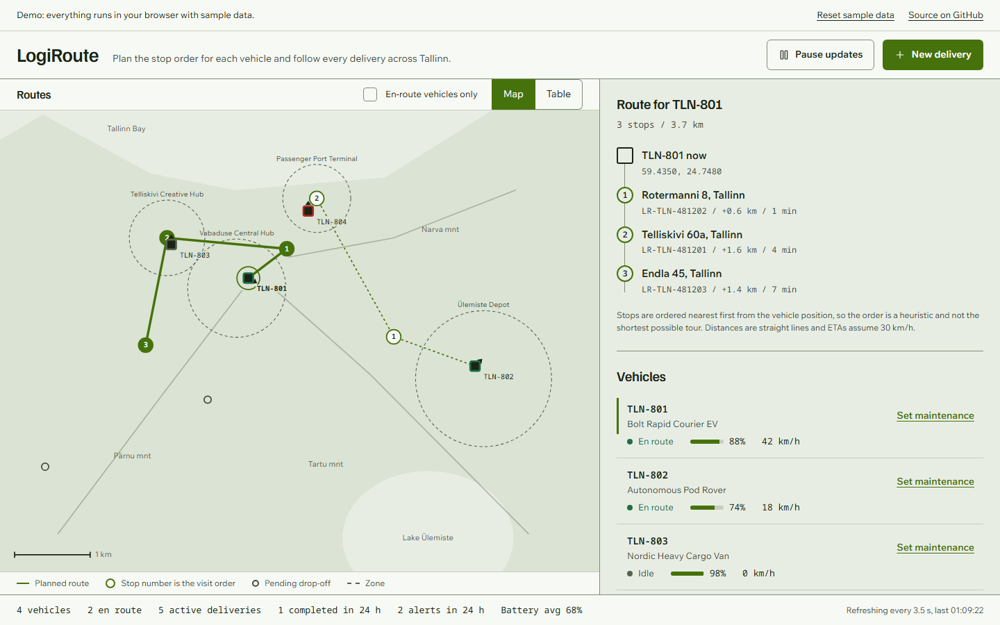

# LogiRoute

LogiRoute is a dispatch console for a small delivery fleet in Tallinn. A dispatcher sees every vehicle on a route map, gets a planned stop order for each one, moves deliveries through their statuses, and watches alerts for zone crossings, speeding and low battery. An Express API with SQLite storage backs it; a demo build runs the same rules in the browser.

[](https://github.com/Taan1el/logiroute/actions/workflows/ci.yml)
[](https://github.com/Taan1el/logiroute/actions/workflows/pages.yml)
[](LICENSE)

**Live demo:** https://taan1el.github.io/logiroute/

The demo runs entirely in your browser with sample data. Nothing is sent or stored; reloading the page or choosing "Reset sample data" restores the start state.

## Screenshots



More: [the same routes as a table](docs/screenshots/02-route-table.png), [deliveries and the assign control](docs/screenshots/03-dispatch.png), [phone width](docs/screenshots/04-mobile.png).

The map takes about 60 percent of the screen and the full height between the header and the status bar. Routes are drawn in green on a flat ground, stops are numbered in visit order. The right column holds the stop timeline of the selected vehicle, the vehicle list, deliveries, alerts and a form for sending position pings. A single status line at the bottom shows fleet counts.

## Features

- **Route map** of central Tallinn drawn as inline SVG: vehicles with heading, one planned route per vehicle with numbered stops, pending drop-offs, zones and a 1 km scale bar. It has a text description and a table view of the same stops.
- **Stop order per vehicle** from a nearest-neighbour heuristic. It is not an optimal tour (see [Design notes and limitations](#design-notes-and-limitations)).
- **Stop timeline** for the selected vehicle: leg distance, straight-line total and ETA per stop.
- **Delivery statuses** that move one step at a time: pending, dispatched, in transit, arrived, completed. A pending delivery is assigned to an idle vehicle; a vehicle in maintenance cannot take work.
- **Alert rules** applied to every position ping: zone entered or left, speed above 50 km/h, battery falling below 15%.
- **ETAs** recomputed from the remaining straight-line distance after each ping; an in-transit delivery within 80 m of its drop-off becomes "arrived".
- **Ping tools**: a form for one position report, a button that moves every en-route vehicle 20 percent of the way to its first stop, and shortcuts for an overspeed and a low-battery ping.
- **Status bar** with vehicles, en route, active deliveries, completed and alerts in the last 24 hours, and average battery.
- **Demo build for GitHub Pages** that needs no server.

## Getting started

### Prerequisites

- Node.js 22.13 or newer (the server uses the built-in `node:sqlite`; CI runs 22 and 24)
- npm 10 or newer

### Install and run

```bash
git clone https://github.com/Taan1el/logiroute.git
cd logiroute
npm install
npm run dev:server   # API on http://localhost:4000
npm run dev:client   # console on http://localhost:5173, proxies /api to the API
```

Open http://localhost:5173. The server creates `server/data/logiroute.db` on first start and fills it with four vehicles, four zones, three deliveries and two alerts. The file is ignored by git.

### Environment variables

None is required.

| Variable | Used by | Default | Purpose |
|---|---|---|---|
| `PORT` | server | `4000` | Port the API listens on. See `server/.env.example`. |
| `DATABASE_URL` | server | `./data/logiroute.db` | SQLite file path; `:memory:` is accepted. |
| `CLIENT_DIST` | server | built `client/dist` if found | Folder with the built client to serve next to the API. |
| `VITE_API_TARGET` | client (dev only) | `http://localhost:4000` | Where the Vite dev server proxies `/api`. See `client/.env.example`. |

## Scripts

| Command | What it does |
|---|---|
| `npm run dev:server` / `npm run dev:client` | Start the API with `tsx watch` / the Vite dev server. |
| `npm run build` | Compile the server to `server/dist` and bundle the client to `client/dist`. |
| `npm run build:pages` | Build the client in demo mode with the `/logiroute/` base path. |
| `npm test` | Run the server and client test suites. |
| `npm run lint` | Type-check both workspaces with `tsc --noEmit`. |
| `npm start --workspace=server` | Run the compiled server (after `npm run build`); it also serves `client/dist`. |

To preview the demo build locally: `npm run build:pages`, then `npx vite preview --mode pages` from `client/`, and open `/logiroute/`.

## How it works

```
shared/          pure rules: types, geometry, validation, statuses, alerts, ETAs, metrics, route order
server/src/      Express routes, controllers, services, repositories, SQLite schema and seed
client/src/      React console; services/ picks the HTTP client or the demo backend
client/src/demo/ in-memory backend and fixed sample data used by the Pages build
```

- **Ping handling.** `POST /api/telemetry/ingest` validates the report, evaluates the alert rules against the previous position, stores the ping and any alerts, updates the vehicle, then recomputes ETAs and arrival for its deliveries. Alerts come back in the response.
- **Routes.** The client builds routes from vehicles and deliveries with `buildFleetRoutes`: each vehicle with dispatched or in-transit deliveries gets its stops ordered nearest first from its current position.
- **Demo mode.** `vite --mode pages` sets the base path and `VITE_DEMO_MODE`. The client then uses `createDemoBackend`, which applies the same shared rules to in-memory sample data.
- **Docker.** The image builds both workspaces, runs `node dist/server/src/index.js` as a non-root user, serves the built client and keeps the database in the `/data` volume.

## API reference

All responses are `{ success, data }` or `{ success: false, error }`.

| Method | Endpoint | Description |
|---|---|---|
| `GET` | `/api/health` | Health check with a timestamp. |
| `GET` | `/api/vehicles` | List vehicles with their last reported state. |
| `GET` | `/api/vehicles/:id` | One vehicle. |
| `PATCH` | `/api/vehicles/:id/status` | Set `idle`, `en_route` or `maintenance`. A vehicle with active deliveries must stay `en_route`. |
| `GET` | `/api/geofences` | List circular zones. |
| `POST` | `/api/geofences` | Create a zone (`name`, `center_lat`, `center_lng`, `radius_meters`). |
| `GET` | `/api/deliveries` | List deliveries, optionally `?status=`. |
| `GET` | `/api/deliveries/:id` | One delivery. |
| `POST` | `/api/deliveries` | Create a delivery; with `vehicle_id` it is dispatched at once. |
| `PATCH` | `/api/deliveries/:id/status` | Move to the next status only. |
| `POST` | `/api/deliveries/:id/assign` | Assign an idle vehicle to a pending delivery. |
| `POST` | `/api/telemetry/ingest` | Send one position report and get the alerts it raised. |
| `GET` | `/api/alerts` | Newest alerts first, `?limit=` (default 50, at most 500). |
| `GET` | `/api/metrics` | Counts for vehicles, en route, active deliveries, completed and alerts in 24 hours, average battery. |

`POST /api/deliveries` needs a non-empty `destination_address` and finite numeric `dropoff_lat` (-90..90) and `dropoff_lng` (-180..180); zero is valid, numeric strings and `null` are rejected with 400. `pickup_lat` and `pickup_lng` default to 59.4335 and 24.745 when omitted. Addresses are trimmed.

## Testing

```bash
npm test
```

104 server tests cover the routes, validation errors, status transitions, alert rules, metrics and the route heuristic (including a case where it is not optimal) using in-memory SQLite. 29 client tests cover the console with React Testing Library against a `fetch` stub, the demo backend, and the demo bar. Timers are faked, so the suites do not sleep. CI runs lint, tests, both builds and a Docker build on Node 22 and 24.

## Deployment

- **Docker:** `docker compose up --build`, then open http://localhost:4000. The database lives in the `logiroute-data` volume.
- **GitHub Pages:** `.github/workflows/pages.yml` builds with `npm run build:pages` and deploys `client/dist` when the repository is public.

## Design notes and limitations

- Route order is a nearest-neighbour heuristic. It is quick and predictable and can produce a longer tour than the best one. Legs are straight lines, not streets, and ETAs assume 30 km/h with no traffic or service time.
- The map is schematic: the bay, lake and streets are rough shapes, and coordinates outside 59.400..59.455 N and 24.690..24.830 E are clamped to the edge of the picture.
- The console polls the API every 3.5 seconds. There is no push channel, so it is not a live tracker; positions are whatever the last ping said.
- Position pings are stored but not read back. There is no history view.
- There is no authentication, and vehicles and zones cannot be created from the console.
- SQLite calls are synchronous and multi-step changes (such as assigning a vehicle) are not wrapped in a transaction. That suits one dispatcher and a few vehicles.
- Zones are circles only.

The decisions behind these choices are in [docs/adr](docs/adr).

## Roadmap

- Road-aware distances and a better stop-ordering step.
- Vehicle and zone management in the console.
- A ping history per vehicle.
- Transactions around multi-step changes.

## License

MIT, see [LICENSE](LICENSE).
