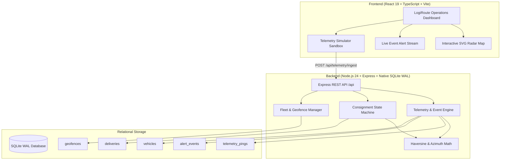

# LogiRoute 🚚📍
> **Fleet Logistics, Real-time Geofence Alerts & Telemetry Dispatch Platform**  
> *Built for Tallinn Urban Logistics Corridors & Autonomous Dispatch Operations*

[](#)
[](#)
[](#)
[-003B57.svg?style=flat-square)](#)
[](#)
[](#)
[](#)

---

## ⚡ 2-Minute Overview
**LogiRoute** is a production-grade full-stack fleet logistics management platform designed to track delivery fleets, ingest high-throughput GPS telemetry, enforce geofence compliance, and manage end-to-end parcel consignment lifecycles across Tallinn's urban corridors.

### Core Capabilities
1. **Real-time GPS Telemetry Ingestion**: Sub-millisecond ingestion pipeline calculating vehicle speed, battery depletion, and compass heading azimuth.
2. **Geofence Boundary Engine**: Pure trigonometric Haversine spherical math detecting perimeter crossings into/out of key distribution hubs (*Vabaduse Väljak*, *Ülemiste Smart City*, *Telliskivi Creative Hub*, *Tallinn Passenger Port*).
3. **Automated Anomaly & Violation Alerts**: Real-time event triggers for speed violations (> 50 km/h urban limit), low-battery thresholds (< 15%), and unauthorized perimeter departures.
4. **Interactive SVG Radar & Dispatch Map**: Zero-dependency, self-contained SVG map projection rendering active vehicle positions, directional headings, active transit corridors, and geofences without external third-party map API keys.
5. **Consignment Delivery Lifecycle**: Strict state-machine transitions (`pending` $\to$ `dispatched` $\to$ `in_transit` $\to$ `arrived_at_hub` $\to$ `completed`) with dynamic ETA calculation based on real-time distance.

---

## 🏛️ System Architecture



---

## 🚀 Quick Start (Zero-Config)

### Prerequisites
- Node.js 24+ (uses native `node:sqlite`)
- npm 10+

### Local Development
```bash
# 1. Clone repository
git clone https://github.com/Taan1el/logiroute.git
cd logiroute

# 2. Install workspace dependencies
npm install

# 3. Start backend API and frontend Vite dev server concurrently
npm run dev

# Backend runs at:  http://localhost:4000
# Frontend runs at: http://localhost:5173
```

### Running Automated Tests
```bash
# Run all unit and integration tests (24 passing)
npm test

# Run type checks and linting
npm run lint

# Build production bundles
npm run build
```

### Docker Deployment
```bash
# Spin up production container with persistent SQLite volume
docker compose up --build
# Open http://localhost:4000 in your browser
```

---

## 📡 REST API Reference

| Method | Endpoint | Description |
|---|---|---|
| `GET` | `/api/health` | Healthcheck and timestamp |
| `GET` | `/api/vehicles` | List all fleet vehicles with real-time telemetry |
| `GET` | `/api/vehicles/:id` | Get single vehicle details |
| `PATCH` | `/api/vehicles/:id/status` | Update vehicle status (`idle`, `en_route`, `maintenance`) |
| `GET` | `/api/geofences` | List registered geofence perimeters |
| `POST` | `/api/geofences` | Register a new circular geofence |
| `GET` | `/api/deliveries` | List consignments (filter by `status`) |
| `POST` | `/api/deliveries` | Create delivery order (computes distance & initial ETA) |
| `PATCH` | `/api/deliveries/:id/status`| Transition delivery status in finite state machine |
| `POST` | `/api/deliveries/:id/assign`| Assign vehicle to consignment and dispatch |
| `POST` | `/api/telemetry/ingest` | Ingest GPS ping, evaluate geofences & trigger alerts |
| `GET` | `/api/alerts` | Paginated live alert stream |
| `GET` | `/api/metrics` | Fleet aggregated KPIs (en route, battery, active deliveries) |

---

## 📐 Architecture Decision Records (ADRs)

Detailed rationale on technical choices:
- [ADR 001: Native SQLite WAL and Haversine Geospatial Mathematics](docs/adr/001-native-sqlite-wal-and-haversine-geospatial-math.md)
- [ADR 002: Event-Driven Telemetry Ingestion and Reactive Alert State Machine](docs/adr/002-event-driven-telemetry-ingestion-and-alert-state-machine.md)
- [ADR 003: SVG Radar Projection and Optimistic Dispatch Coordination](docs/adr/003-svg-radar-projection-and-optimistic-dispatch-coordination.md)

---

## 🧪 Verification & Quality Checklist

- [x] **24 Automated Tests Passing** (18 backend integration + 6 frontend component tests).
- [x] **TypeScript Strict Mode** with zero `any` leaks in domain models.
- [x] **Zero External Map API Key Friction**: Built-in SVG radar projection renders immediately without third-party tokens.
- [x] **Relational Schema**: Enforces foreign keys, indexes, and transactional consistency.
- [x] **Multi-stage Dockerfile & Compose**: Production container with health checks and data volumes.
